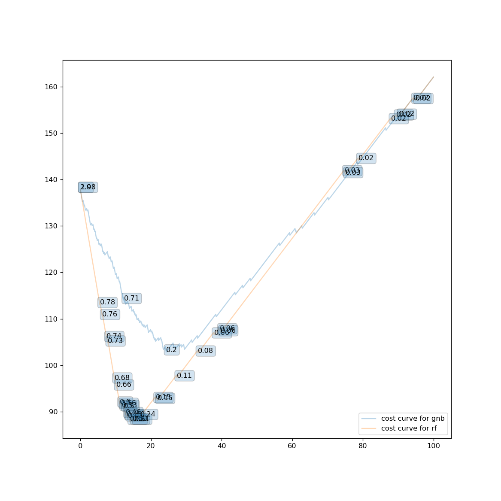

# Telecom_churn
## Classification on telecom churn data with Cost reduction using appropriate Algorithms.
Customer churn is a major problem and one of the most important concerns for large companies. 
Due to the direct effect on the revenues of the companies, especially in the telecom field, 
companies are seeking to develop means to predict potential customer to churn. 
Therefore, finding factors that increase customer churn is important to take necessary actions to reduce this churn.
In this project different algorithms were applied to predict if a customer would churn or not.Many metrics like accuracy, precision, recall, roc curvers, etc were used with cost matrix to minimize the cost to the company.

